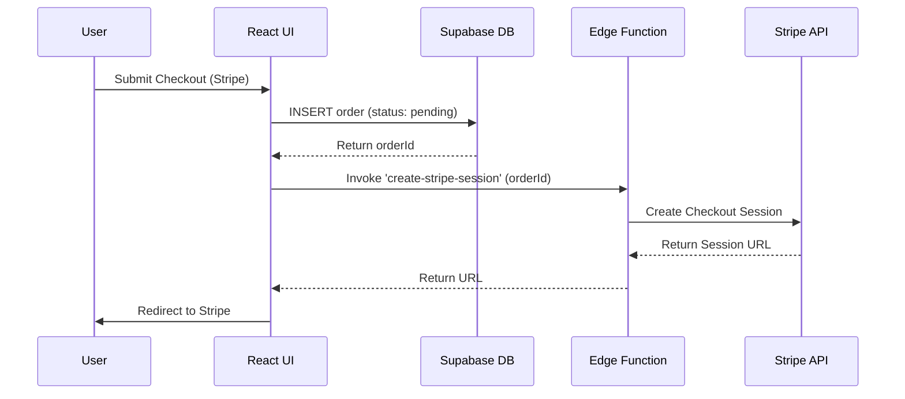

# React E-Commerce Platform: Sonny Store


## 1. PROJECT OVERVIEW & HIGHLIGHTS

**Sonny Store** is a high-performance, fully responsive React E-Commerce platform tailored for selling flagship smartphones and mobile devices. Engineered for production-grade reliability, it combines a highly interactive frontend with a secure, serverless backend.

**Core Value Propositions:**
- **Zero-CLS Layouts & Fluid Responsiveness:** Painstakingly crafted with Tailwind CSS v4 to guarantee flawless rendering across all viewports (from 320px mobile up to ultrawide desktop monitors).
- **Hybrid Payment Architecture:** Supports both traditional Cash on Delivery (COD) and seamless Online Payments via Stripe Checkout.
- **Serverless Backend:** Built on top of Supabase (PostgreSQL + Auth) with Deno-powered Edge Functions ensuring secure payment session handling without managing a traditional Node.js server.
- **Modern UX:** Features dynamic routing, sleek SVG-based loading spinners, optimistic UI updates, cart drawers, and an authenticated admin dashboard for operations.

---

## 2. TECH STACK & INFRASTRUCTURE MATRIX

### Frontend
- **Framework:** React 19 + Vite (for lightning-fast HMR and optimized builds)
- **Styling:** Tailwind CSS v4 (Utility-first, responsive, and completely migrated from legacy CSS)
- **Routing:** React Router DOM (v6/v7) for SPA navigation, route guards, and nested layouts.
- **Icons:** `react-icons` (Lucide, BoxIcons, FontAwesome)
- **Forms & Validation:** `react-hook-form` paired with `zod` schema validation.
- **Animations:** `framer-motion` for page transitions and micro-interactions.

### Backend & Database (Supabase)
- **Database:** PostgreSQL (fully relational schema with Row Level Security policies).
- **Authentication:** Supabase Auth (Email/Password, secure session management).
- **Storage:** Supabase Storage (product images, thumbnails).
- **Edge Compute:** Supabase Edge Functions (Deno runtime) for secure backend execution.

### Payment Gateway
- **Integration:** Stripe API (Hosted Checkout Sessions, secure webhook integration).

---

## 3. CORE FEATURES & FUNCTIONALITIES

- **Dynamic Product Catalog & Filtering:** Real-time search and multi-criteria filtering on the Shop Page.
- **Cart & Wishlist Management:** Persistent shopping cart (via context API) with a sliding side drawer for quick access. Wishlist functionality for saving favorites.
- **Hybrid Checkout Engine:** Users can select between Cash on Delivery (COD) or Online Payment (Stripe).
- **Order Lifecycle Tracking:** Authenticated users have a dedicated "My Orders" page to track status (`pending`, `processing`, `shipped`, `delivered`).
- **Comprehensive Admin Dashboard:** Protected route (`/admin`) allowing administrators to:
  - View high-level KPIs (Revenue, Orders, Users).
  - Manage the phone catalog (Add, Edit, Delete).
  - Monitor and update order statuses.
  - Manage users (Block/Unblock, View details).
- **Modern UI/UX Elements:** 
  - Centralized `<Spinner />` component for all asynchronous loading states.
  - Interactive, fluid carousels and brand selectors.
  - Mobile-first, hamburger navigation.

---

## 4. SYSTEM ARCHITECTURE & PAYMENT FLOW

The checkout flow utilizes a hybrid approach, seamlessly integrating database logging with secure third-party payment processing.

### Transaction Lifecycle:
1. **React Checkout:** User fills out the Zod-validated shipping form and selects "Pay Online via Card".
2. **Order Pending in DB:** The React app securely calls Supabase to create an `order` and `order_items` record with status `pending`.
3. **Edge Function Invocation:** React invokes the `create-stripe-session` Supabase Edge Function, passing the newly generated `orderId`.
4. **Stripe Checkout Session:** The Deno Edge function communicates securely with Stripe API (using `STRIPE_SECRET_KEY`) to generate a Checkout URL.
5. **Redirect & Auto-Clearing Cart:** The user is redirected to Stripe's hosted checkout. Upon successful payment, they return to the `/order-success` page.
6. **Status Update:** A webhook (or manual verification) finalizes the order status to `completed`.



---

## 5. DATABASE SCHEMA & TABLES

The PostgreSQL database (managed via Supabase) relies on the following core tables:

- **`phones`**: Stores product details.
  - Columns: `id`, `name`, `brand`, `price` (JSON/Numeric), `thumbnail`, `images` (Array), `category`, `specs` (JSONB), `colors` (Array), `variants` (JSONB), `created_at`.
- **`profiles` / Users**: Managed primarily by Supabase Auth, but extended via triggers for role management (`role: 'admin' | 'user' | 'blocked'`).
- **`orders`**: Tracks customer orders.
  - Columns: `id`, `user_id` (FK), `full_name`, `phone`, `city`, `address`, `notes`, `payment_method`, `total_amount`, `status` (`pending`, `processing`, `shipped`, `delivered`, `cancelled`), `created_at`.
- **`order_items`**: Junction table for order details.
  - Columns: `id`, `order_id` (FK), `product_id` (FK), `product_name`, `price`, `quantity`, `image_url`.
- **`favorites` / Wishlist**: Maps `user_id` to `phone_id`.

*(Note: Row Level Security (RLS) policies govern all table access, ensuring users only read/write their own orders while admins have global access).*

---

## 6. ENVIRONMENT VARIABLES & LOCAL SETUP GUIDE

### Required Environment Variables
Create a `.env.local` (or `.env`) file in the root directory:

```env
VITE_SUPABASE_URL=your_supabase_project_url
VITE_SUPABASE_ANON_KEY=your_supabase_anon_key
VITE_STRIPE_PUBLISHABLE_KEY=your_stripe_publishable_key
```

### Local Setup Instructions

1. **Clone & Install Dependencies**
   ```bash
   git clone <repo-url>
   cd e-commercee
   npm install
   ```

2. **Configure Supabase CLI & Edge Functions**
   ```bash
   supabase login
   supabase link --project-ref your_project_ref
   ```

3. **Set Stripe Secret for Edge Functions**
   ```bash
   supabase secrets set STRIPE_SECRET_KEY=sk_test_your_secret_key
   ```

4. **Deploy Edge Functions**
   ```bash
   supabase functions deploy create-stripe-session
   ```

5. **Run Development Server**
   ```bash
   npm run dev
   ```

---

## 7. PROJECT FOLDER STRUCTURE

```
e-commercee/
├── public/                 # Static assets
├── supabase/               
│   └── functions/          # Deno Edge Functions
│       └── create-stripe-session/
│           └── index.ts    # Stripe integration logic
├── src/
│   ├── assets/             # Images, static media
│   ├── components/
│   │   ├── layout/         # TopHeader, BotHeader, Footer
│   │   └── ui/             # PhoneCard, Spinner, FeaturesBar, etc.
│   ├── context/            # React Context (Auth, Cart, Fav, Data)
│   ├── features/           # Domain-specific logic
│   │   ├── admin/          # useAdminDashboard hook
│   │   ├── auth/           # Login/Signup forms
│   │   ├── cart/           # CartDrawer
│   │   └── products/       # BrandButtons, Swipers
│   ├── lib/                # Third-party clients (supabaseClient.js, stripe.js)
│   ├── pages/              # Route components (Home, Shop, Checkout, Admin, etc.)
│   ├── routes/             # ProtectedRoute, AdminRoute wrappers
│   ├── App.jsx             # Main App component & Route definitions
│   ├── index.css           # Tailwind v4 configuration & root styles
│   └── main.jsx            # Application entry point
├── .env                    # Environment variables template
├── package.json            
├── vite.config.js          
└── README.md               # Documentation
```
